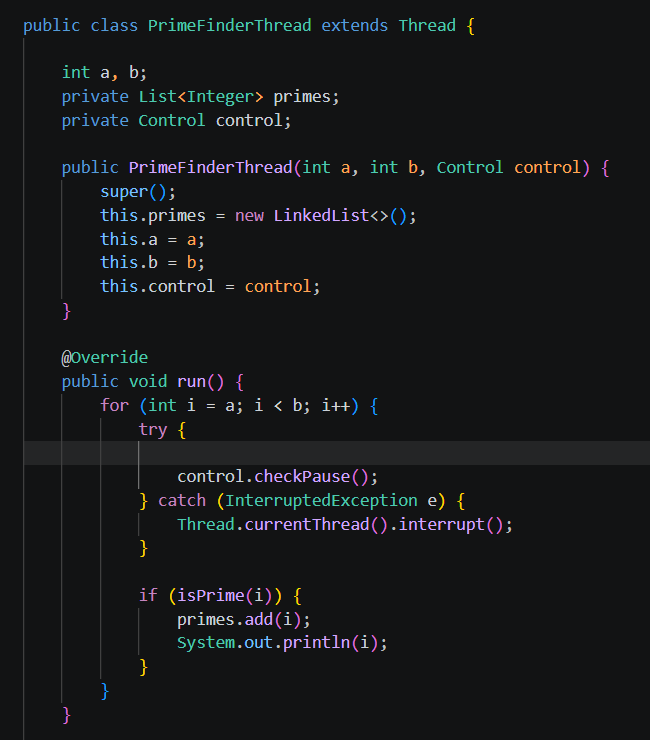
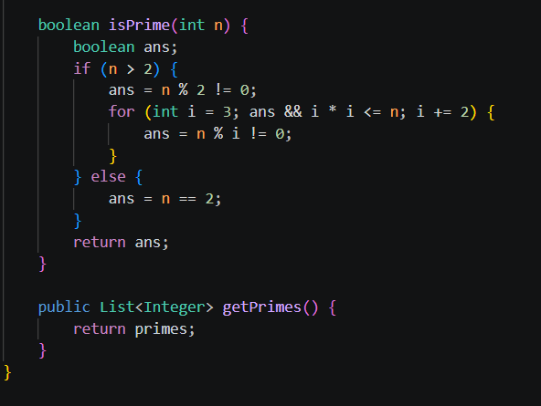
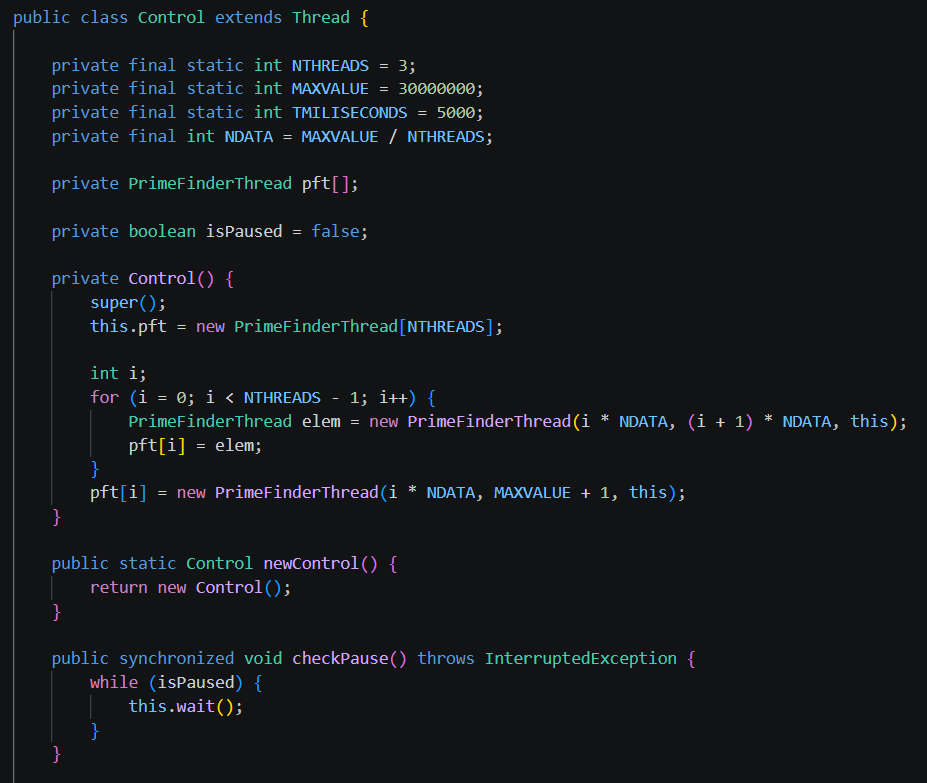
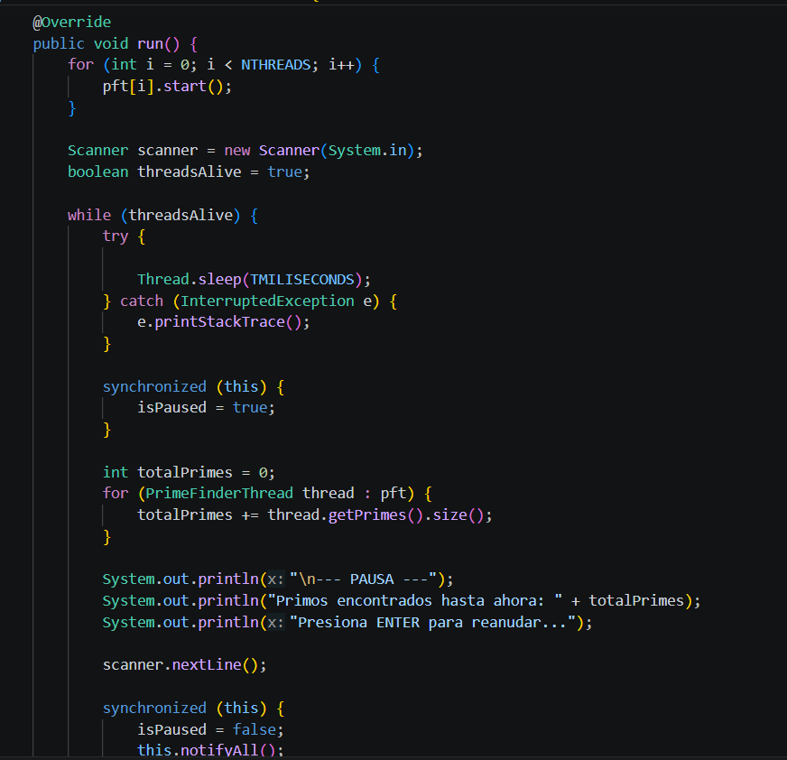
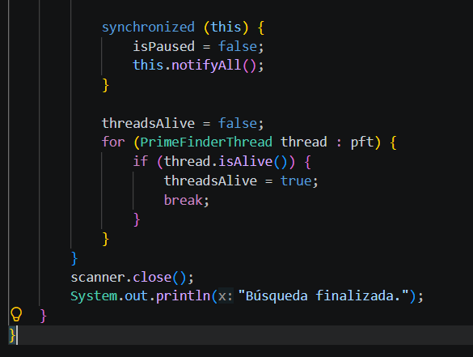

# Snake Race — ARSW Lab #2 (Java 21, Virtual Threads)

**Escuela Colombiana de Ingeniería – Arquitecturas de Software**  
Laboratorio de programación concurrente: condiciones de carrera, sincronización y colecciones seguras.

---
## Autores
Tomás Quiceno 
Deisy Guzmán

## Requisitos

- **JDK 21** (Temurin recomendado)
- **Maven 3.9+**
- SO: Windows, macOS o Linux

---

## Cómo ejecutar

```bash
mvn clean verify
mvn -q -DskipTests exec:java -Dsnakes=4
```

- `-Dsnakes=N` → inicia el juego con **N** serpientes (por defecto 2).
- **Controles**:
  - **Flechas**: serpiente **0** (Jugador 1).
  - **WASD**: serpiente **1** (si existe).
  - **Espacio** o botón **Action**: Pausar / Reanudar.

---

## Reglas del juego (resumen)

- **N serpientes** corren de forma autónoma (cada una en su propio hilo).
- **Ratones**: al comer uno, la serpiente **crece** y aparece un **nuevo obstáculo**.
- **Obstáculos**: si la cabeza entra en un obstáculo hay **rebote**.
- **Teletransportadores** (flechas rojas): entrar por uno te **saca por su par**.
- **Rayos (Turbo)**: al pisarlos, la serpiente obtiene **velocidad aumentada** temporal.
- Movimiento con **wrap-around** (el tablero “se repite” en los bordes).

---

## Arquitectura (carpetas)

```
co.eci.snake
├─ app/                 # Bootstrap de la aplicación (Main)
├─ core/                # Dominio: Board, Snake, Direction, Position
├─ core/engine/         # GameClock (ticks, Pausa/Reanudar)
├─ concurrency/         # SnakeRunner (lógica por serpiente con virtual threads)
└─ ui/legacy/           # UI estilo legado (Swing) con grilla y botón Action
```

---

# Actividades del laboratorio

## Parte I — (Calentamiento) `wait/notify` en un programa multi-hilo

1. Toma el programa [**PrimeFinder**](https://github.com/ARSW-ECI/wait-notify-excercise).
2. Modifícalo para que **cada _t_ milisegundos**:
   - Se **pausen** todos los hilos trabajadores.
   - Se **muestre** cuántos números primos se han encontrado.
   - El programa **espere ENTER** para **reanudar**.
3. La sincronización debe usar **`synchronized`**, **`wait()`**, **`notify()` / `notifyAll()`** sobre el **mismo monitor** (sin _busy-waiting_).
4. Entrega en el reporte de laboratorio **las observaciones y/o comentarios** explicando tu diseño de sincronización (qué lock, qué condición, cómo evitas _lost wakeups_).

> Objetivo didáctico: practicar suspensión/continuación **sin** espera activa y consolidar el modelo de monitores en Java.

## Solución Parte I

### Modificaciones en PrimeFinderThread.java

Se necesita que cada hilo consulte periódicamente si debe pausarse. Se le pasa una referencia de Control y se llama a un método que evalúe la condición en cada iteración del ciclo.




### Modificaciones en Control.java

En el controlador, se define la variable de estado (isPaused), el método sincronizado para que los hilos esperen, y el ciclo de suspensión/reanudación usando temporizadores y la lectura del teclado.





-  ¿Qué Lock se utilizó?: Se utilizó el monitor de la instancia de la clase Control (representado por this dentro de sus métodos sincronizados). Al pasar esta referencia a cada PrimeFinderThread, garantizamos que tanto el hilo coordinador como los hilos trabajadores sincronicen sobre el mismo objeto en memoria.

-  ¿Qué condición dicta la pausa?: La variable booleana isPaused. Su acceso y modificación están protegidos por el bloque synchronized, asegurando visibilidad y previniendo condiciones de carrera.

- ¿Cómo se evitan los lost wakeups (despertares perdidos) y spurious wakeups?: En lugar de usar un simple bloque if (isPaused), el método wait() se implementó dentro de un ciclo while (isPaused). Si un hilo recibe un notify de forma accidental (spurious wakeup) o antes de que realmente deba despertar, el ciclo while forzará a que vuelva a evaluar la variable isPaused. Si sigue siendo true, el hilo volverá a invocar wait() inmediatamente de forma segura.

---

## Parte II — SnakeRace concurrente (núcleo del laboratorio)

### 1) Análisis de concurrencia

- Explica **cómo** el código usa hilos para dar autonomía a cada serpiente.
- **Identifica** y documenta en **`el reporte de laboratorio`**:
  - Posibles **condiciones de carrera**.
  - **Colecciones** o estructuras **no seguras** en contexto concurrente.
  - Ocurrencias de **espera activa** (busy-wait) o de sincronización innecesaria.

### 2) Correcciones mínimas y regiones críticas

- **Elimina** esperas activas reemplazándolas por **señales** / **estados** o mecanismos de la librería de concurrencia.
- Protege **solo** las **regiones críticas estrictamente necesarias** (evita bloqueos amplios).
- Justifica en **`el reporte de laboratorio`** cada cambio: cuál era el riesgo y cómo lo resuelves.

### 3) Control de ejecución seguro (UI)

- Implementa la **UI** con **Iniciar / Pausar / Reanudar** (ya existe el botón _Action_ y el reloj `GameClock`).
- Al **Pausar**, muestra de forma **consistente** (sin _tearing_):
  - La **serpiente viva más larga**.
  - La **peor serpiente** (la que **primero murió**).
- Considera que la suspensión **no es instantánea**; coordina para que el estado mostrado no quede “a medias”.

### 4) Robustez bajo carga

- Ejecuta con **N alto** (`-Dsnakes=20` o más) y/o aumenta la velocidad.
- El juego **no debe romperse**: sin `ConcurrentModificationException`, sin lecturas inconsistentes, sin _deadlocks_.
- Si habilitas **teleports** y **turbo**, verifica que las reglas no introduzcan carreras.

> Entregables detallados más abajo.

---

## Entregables

1. **Código fuente** funcionando en **Java 21**.
2. Todo de manera clara en **`**el reporte de laboratorio**`** con:
   - Data races encontradas y su solución.
   - Colecciones mal usadas y cómo se protegieron (o sustituyeron).
   - Esperas activas eliminadas y mecanismo utilizado.
   - Regiones críticas definidas y justificación de su **alcance mínimo**.
3. UI con **Iniciar / Pausar / Reanudar** y estadísticas solicitadas al pausar.

---

## Criterios de evaluación (10)

- (3) **Concurrencia correcta**: sin data races; sincronización bien localizada.
- (2) **Pausa/Reanudar**: consistencia visual y de estado.
- (2) **Robustez**: corre **con N alto** y sin excepciones de concurrencia.
- (1.5) **Calidad**: estructura clara, nombres, comentarios; sin _code smells_ obvios.
- (1.5) **Documentación**: **`reporte de laboratorio`** claro, reproducible;

---

## Tips y configuración útil

- **Número de serpientes**: `-Dsnakes=N` al ejecutar.
- **Tamaño del tablero**: cambiar el constructor `new Board(width, height)`.
- **Teleports / Turbo**: editar `Board.java` (métodos de inicialización y reglas en `step(...)`).
- **Velocidad**: ajustar `GameClock` (tick) o el `sleep` del `SnakeRunner` (incluye modo turbo).

---

## Cómo correr pruebas

```bash
mvn clean verify
```

Incluye compilación y ejecución de pruebas JUnit. Si tienes análisis estático, ejecútalo en `verify` o `site` según tu `pom.xml`.

---

## Créditos

Este laboratorio es una adaptación modernizada del ejercicio **SnakeRace** de ARSW. El enunciado de actividades se conserva para mantener los objetivos pedagógicos del curso.

**Base construida por el Ing. Javier Toquica.**
